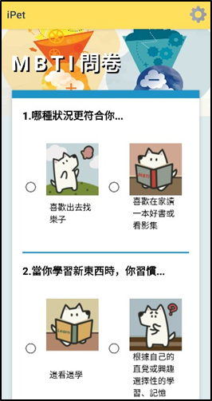
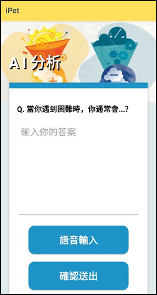
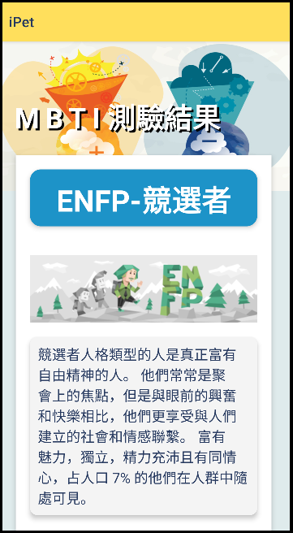
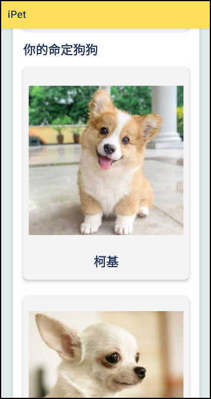
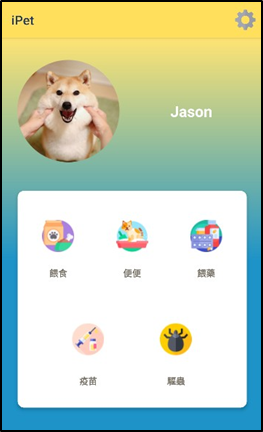

#  iPet｜MBTI 犬種推薦與健康提醒 App

iPet 是一款 Android App，讓使用者可以透過 MBTI 人格來了解自己適合什麼樣的犬種，並同時結合了健康提醒的功能，提供使用者全方位的寵物照護體驗。

---

##  專案目標

本專題旨在開發一款結合「心理人格測驗（MBTI）」與「寵物犬種推薦」的 App。使用者可透過人格測驗結果，獲得最適合自己的犬種建議，並提供後續的寵物照護提醒（健康、飼養建議等）。

---

##  職責分工

在本專案中，我主要負責：

- 使用 Java 實作 App 的後端邏輯與介接模組  
- 管理 PostgreSQL 資料庫，負責資料儲存、查詢與維護  
- 建置並整合 Python 模型伺服器（人格分析與犬種推薦）  
- 協助 Android Studio 的前後端整合與功能測試

---

##  技術棧

| 分類 | 使用技術 |
|------|----------|
| 開發語言 | Java, Python |
| 開發平台 | Android Studio |
| 資料庫 | PostgreSQL |
| 模型 | Random Forest (人格辨識) |
| 通訊技術 | Socket (Python ↔ App) |
| 推薦邏輯 | 根據 MBTI 與犬種性格資料比對 |

---

##  專案結構

- `default_models/`：jpyserver.py 使用的 RandomForest 模型資料
- `iPet/`：Android Studio App 主體
- `jpyserver.py`：用於人格分析與犬種推薦的 Python 伺服器程式
- `project.sql`：資料庫建置 SQL 檔案
- `iPet 專題成果書.pdf`：專題簡報與報告文件

---

##  開發工具與依賴模組

###  PC 端
- [Android Studio](https://developer.android.com/studio/)

###  Server 端
- [PostgreSQL](https://www.postgresql.org/download/)
- [Python](https://www.python.org/downloads/)
- 安裝必要 Python 模組：
```bash
pip install socket  
pip install joblib  
pip install warnings  
pip install regex  
pip install googletrans
```
---

##  示意圖

### MBTI問卷填答頁面  


### 文字和語音填答頁面  


### MBTI測驗結果頁面  
  


### 寵物照護頁面  



